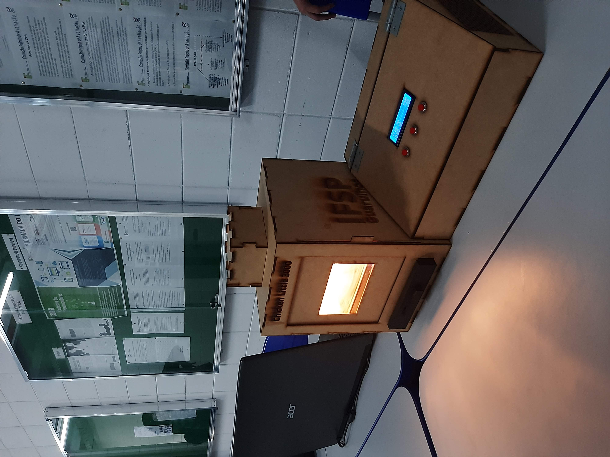

# Chicken Little 3000 🐣

[Leia este README em português](README_PT-BR.md)

The **Chicken Little 3000** is an automated incubator designed to control temperature and humidity during the incubation process of quail and chicken eggs. The system uses sensors to maintain ideal conditions for egg hatching, ensuring a higher success rate. 🌡️💧

> Figures 1 and 2: Physical structure of the Chicken Little 3000

  
  

## Objective 🎯

This project is the **first interdisciplinary project** of the undergraduate program in Control and Automation Engineering. It was developed as part of the academic experience to integrate knowledge from various engineering disciplines, including microcontroller programming, sensor integration, 3D modeling, and automatic temperature and humidity control. 🔧📐

## Features 🌟

- **Temperature and Humidity Control**: The system uses a **DHT22** sensor to measure temperature and humidity inside the incubator.
- **ESP32 Microcontroller**: The system uses the **ESP32**, a versatile and efficient microcontroller, for real-time control and monitoring. ⚡
- **PID Control**: The **PID (Proportional, Integral, Derivative)** control is used to regulate the temperature within the incubator, adjusting the MOSFETs to activate heating efficiently and accurately. 🔥
- **3D Printing**: Some components of the incubator are 3D printed, providing efficient material usage. 🖨️
- **Laser-Cut MDF Structure**: The external structure is made of **MDF**, cut by laser, ensuring precision and durability. 🔥

## Components ⚙️

- **ESP32 Microcontroller**: Main controller for the incubator system.
- **DHT22 Sensor**: Measures temperature and humidity.
- **MOSFETs**: Used to control the power for the heating system and humidifier.
- **Resistors**: Used to adjust current and protect the circuit.
- **LM7805 Voltage Regulator**: Used to regulate 12V to 5V, the required voltage for the ESP32 and other components.
- **12V Power Supply**: Powers the system.
- **RTC Module**: Real-time clock module.
- **Humidifier Module**: Controls the humidity level in the environment.
- **LCD 16x2 I2C Module**: LCD display for data visualization.
- **Push Button**: For interacting with the system.
- **Diode**: Used for reverse polarity protection.
- **3D Printed Parts**: Customized parts created using 3D printing for the internal structure.
- **Laser-Cut MDF**: External box made of laser-cut MDF.

## 3D Model 💻

> Figure 3: 3D Model of the Chicken Little 3000

## Contributing 🤝

If you would like to contribute to this project, feel free to make a **fork** of the repository, create a **branch**, and submit a **pull request** with your changes. Contributions can be made to improve the efficiency of the code, integrate new sensors, implement new features, or enhance the incubator design.

## Other Images 📸
Internal System
(Electronic system image will be added soon)
