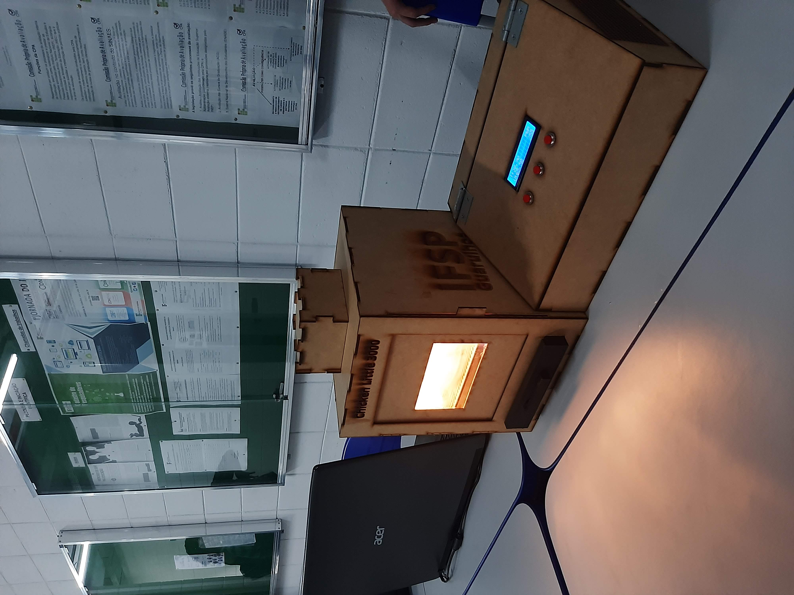
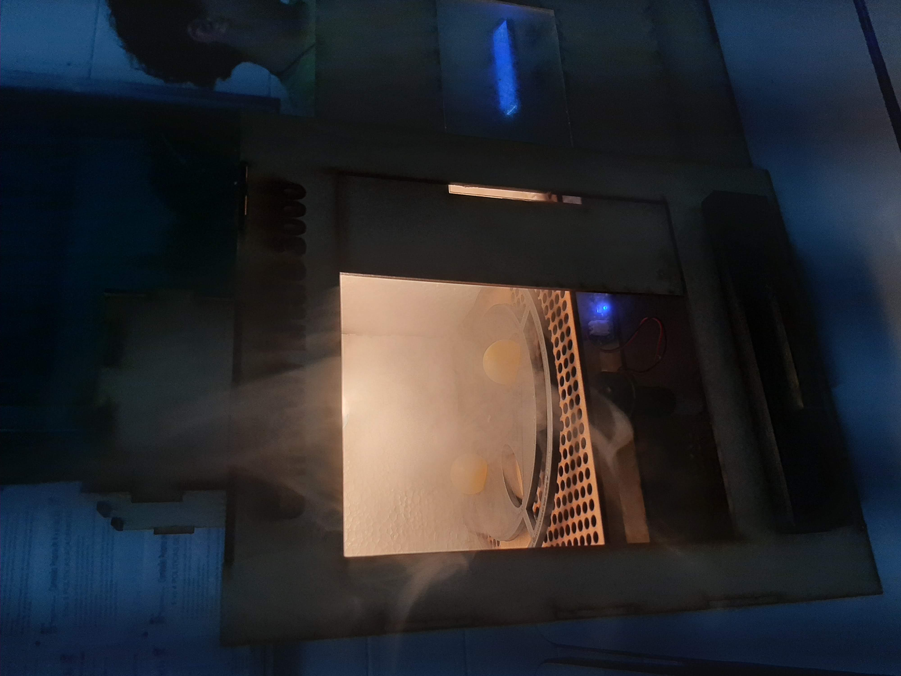
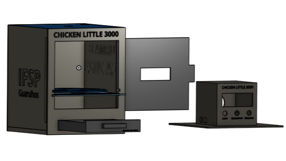

# Chicken Little 3000 🐣

[Read this README in English](README.md)

O **Chicken Little 3000** é uma incubadora automatizada projetada para controlar a temperatura e a umidade durante o processo de incubação dos ovos de codorna e galinha. O sistema usa sensores para manter as condições ideais para a eclosão dos ovos, garantindo uma taxa de sucesso maior. 🌡️💧

> Figuras 1 e 2: Estrutura física do Chicken Little 3000

  
  

## Objetivo 🎯

Este projeto é o **primeiro projeto interdisciplinar** do curso de graduação em Engenharia de Controle e Automação. Foi desenvolvido como parte da experiência acadêmica para integrar o conhecimento de várias disciplinas da engenharia, incluindo programação de microcontroladores, integração de sensores, modelagem 3D e controle automático de temperatura e umidade. 🔧📐

## Características 🌟

- **Controle de Temperatura e Umidade**: O sistema usa um sensor **DHT22** para medir a temperatura e a umidade dentro da incubadora.
- **Microcontrolador ESP32**: O sistema utiliza o **ESP32**, um microcontrolador versátil e eficiente, para controle e monitoramento em tempo real. ⚡
- **Controle PID**: O **PID (Proporcional, Integral, Derivativo)** é utilizado para o controle da temperatura dentro da incubadora, regulando os MOSFETs para acionar o aquecimento de maneira eficiente e precisa. 🔥
- **Impressão 3D**: Alguns componentes da incubadora são impressos em 3D, oferecendo uso eficiente de materiais. 🖨️
- **Estrutura em MDF Cortada a Laser**: A estrutura externa é feita de **MDF**, cortado a laser, garantindo precisão e durabilidade. 🔥

## Componentes ⚙️

- **Microcontrolador ESP32**: Controlador principal para o sistema da incubadora.
- **Sensor DHT22**: Mede a temperatura e a umidade.
- **MOSFETs**: Usados para controlar a potência do sistema de aquecimento e do umidificador.
- **Resistores**: Utilizados para ajustar a corrente e proteger o circuito.
- **Regulador de Tensão LM7805**: Usado para regular a tensão de 12V para 5V, tensão necessária para o ESP32 e outros componentes.
- **Fonte de Alimentação 12V**: Alimenta o sistema.
- **Modulo RTC**: Módulo de controle de tempo real.
- **Modulo Umidificador**: Controla a umidade do ambiente.
- **Modulo LCD 16x2 I2C**: Display LCD para visualização de dados.
- **Push Button**: Para interagir com o sistema.
- **Diodo**: Usado para proteção de polaridade reversa.
- **Peças Impressas em 3D**: Peças personalizadas criadas através de impressão 3D para a estrutura interna.
- **MDF Cortado a Laser**: Caixa externa feita de MDF cortado a laser.

## Modelo 3d 💻

> Figura 3: Modelagem 3d do Chicken Little 3000

## Contribuindo 🤝

Se você quiser contribuir para este projeto, fique à vontade para fazer um **fork** no repositório, criar uma **branch** e enviar um **pull request** com suas mudanças. As contribuições podem ser feitas para melhorar a eficiência do código, a integração de novos sensores, a implementação de novas funcionalidades ou o design da incubadora.

## Outras Imagens 📸
Sistema Interno
(Imagem do sistema eletrônico será adicionada em breve)
